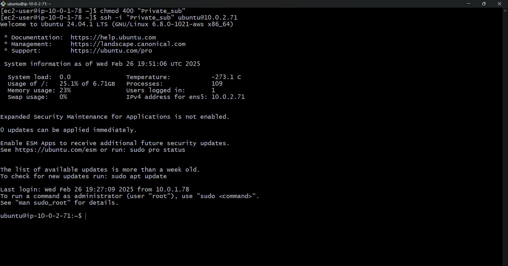

# AWS Virtual Private Cloud (VPC) Setup - Manual Configuration

This document provides a step-by-step guide to manually creating a VPC with subnets, route tables, an Internet Gateway (IGW), a NAT Gateway, and EC2 instances.

## Project Overview
In this project, we will create:

- **VPC (Virtual Private Cloud)**
- **Internet Gateway (IGW)**
- **Subnets:**
  - Public Subnet
  - Private Subnet
- **Route Tables:**
  - Public Route Table
  - Private Route Table
- **NAT Gateway**
- **EC2 Instances:**
  - One in Public Subnet
  - One in Private Subnet

## Step 1: Create a VPC
1. Sign in to AWS Management Console.
2. Navigate to **VPC Dashboard**.
3. Click **Create VPC**.
4. Fill in the details:
   - **VPC Name:** MyCustomVPC
   - **IPv4 CIDR Block:** 10.0.0.0/16
   - **IPv6 CIDR Block:** No IPv6 (optional)
   - **Tenancy:** Default
5. Click **Create VPC**.


## Step 2: Create an Internet Gateway (IGW)
1. Go to **VPC Dashboard → Internet Gateways**.
2. Click **Create Internet Gateway**.
3. Enter **Name:** MyInternetGateway
4. Click **Create Internet Gateway**.
5. Attach IGW to VPC:
   - Select **MyInternetGateway**.
   - Click **Actions → Attach to VPC**.
   - Select **MyCustomVPC**.
   - Click **Attach Internet Gateway**.


## Step 3: Create Subnets
We will create two subnets:

- **Public Subnet (10.0.1.0/24)**
- **Private Subnet (10.0.2.0/24)**


### Create Public Subnet
1. Navigate to **VPC Dashboard → Subnets**.
2. Click **Create Subnet**.
3. Select **VPC:** MyCustomVPC.
4. Enter details:
   - **Subnet Name:** Public-Subnet
   - **IPv4 CIDR Block:** 10.0.1.0/24
   - **Availability Zone:** Select any (e.g., us-east-1a)
5. Click **Create Subnet**.

### Create Private Subnet
1. Click **Create Subnet**.
2. Select **VPC:** MyCustomVPC.
3. Enter details:
   - **Subnet Name:** Private-Subnet
   - **IPv4 CIDR Block:** 10.0.2.0/24
   - **Availability Zone:** us-east-1a
4. Click **Create Subnet**.

## Step 4: Create Route Tables
We need two route tables:

- **Public Route Table** (Routes traffic to the Internet)
- **Private Route Table** (Routes private traffic through NAT Gateway)


### Create Public Route Table
1. Navigate to **VPC Dashboard → Route Tables**.
2. Click **Create Route Table**.
3. Enter:
   - **Name:** Public-Route-Table
   - **VPC:** MyCustomVPC
4. Click **Create Route Table**.
5. Click on the **Public-Route-Table**.
6. Go to **Routes → Edit Routes → Add Route**:
   - **Destination:** 0.0.0.0/0
   - **Target:** Select **MyInternetGateway**
7. Click **Save Routes**.
8. Associate the Public Subnet:
   - Go to **Subnet Associations → Edit Subnet Associations**.
   - Select **Public-Subnet**.
   - Click **Save**.

### Create Private Route Table
1. Click **Create Route Table**.
2. Enter:
   - **Name:** Private-Route-Table
   - **VPC:** MyCustomVPC
3. Click **Create Route Table**.
4. Associate the Private Subnet:
   - Go to **Subnet Associations → Edit Subnet Associations**.
   - Select **Private-Subnet**.
   - Click **Save**.

## Step 5: Create a NAT Gateway (For Private Subnet)
1. Navigate to **VPC Dashboard → NAT Gateways**.
2. Click **Create NAT Gateway**.
3. Select:
   - **Subnet:** Public-Subnet
   - **Elastic IP:** Click **Allocate Elastic IP → Select the new Elastic IP**.
4. Click **Create NAT Gateway**.


5. Go to **Route Tables → Select Private-Route-Table**.
6. Click **Routes → Edit Routes → Add Route**:
   - **Destination:** 0.0.0.0/0
   - **Target:** Select the created **NAT Gateway**.
7. Click **Save Routes**.

## Step 6: Launch EC2 Instances
### Create a Public EC2 Instance
1. Navigate to **EC2 Dashboard → Instances**.
2. Click **Launch Instance**.
3. Choose **Amazon Linux 2** (or any OS).
4. Select **Instance Type** (t2.micro for free tier).
5. Click **Next: Configure Instance Details**.
6. Select **VPC:** MyCustomVPC.
7. Select **Subnet:** Public-Subnet.
8. Enable **Auto-assign Public IP**.
9. Click **Next → Next → Add Security Group**:
   - Allow **SSH (22)** from **0.0.0.0/0**.
10. Click **Review and Launch → Launch**.
11. Select/Create a Key Pair → Click **Launch Instances**.


### Create a Private EC2 Instance
1. Click **Launch Instance**.
2. Choose **Amazon Linux 2**.
3. Select **Instance Type** (t2.micro).
4. Select **VPC:** MyCustomVPC.
5. Select **Subnet:** Private-Subnet.
6. **DO NOT** enable Public IP.
7. Use an existing Security Group with **SSH access only from the public EC2** (optional).
8. Click **Review and Launch → Launch**.

## Step 7: Test Connectivity
### Connect to Public EC2
1. Open a terminal.
2. SSH into the public EC2 instance:
```sh
ssh -i your-key.pem ec2-user@public-ec2-ip
```


### Connect to Private EC2 via Public EC2
1. Once inside the **public EC2**, SSH into the private EC2:
```sh
ssh -i your-key.pem ec2-user@private-ec2-ip
```


## Architecture Diagram


## Future Enhancements
- Automate the setup using **Terraform** or **CloudFormation**.
- Add more **subnets** in different **Availability Zones**.
- Enable **monitoring** using **CloudWatch**.

## Conclusion
This document explains how to manually create a **VPC, subnets, route tables, NAT, and EC2 instances** in AWS. 
